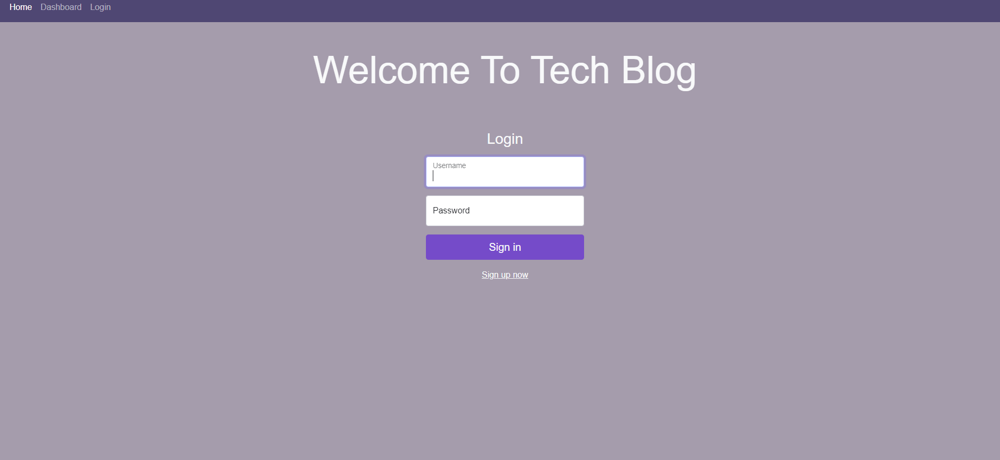
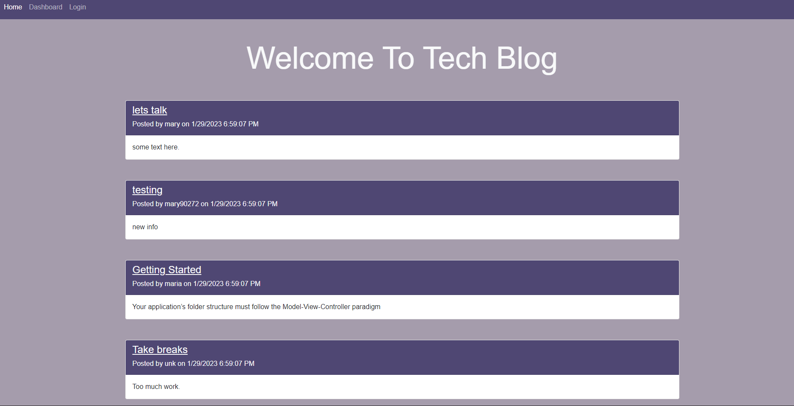
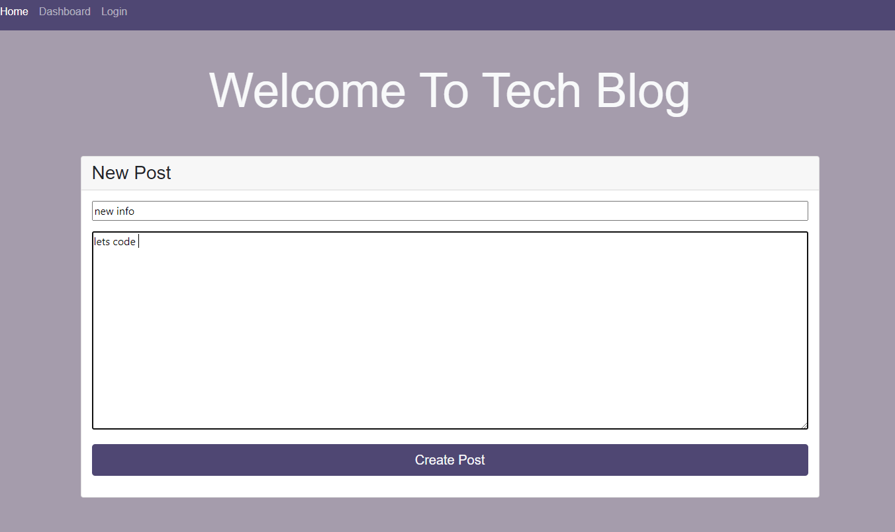
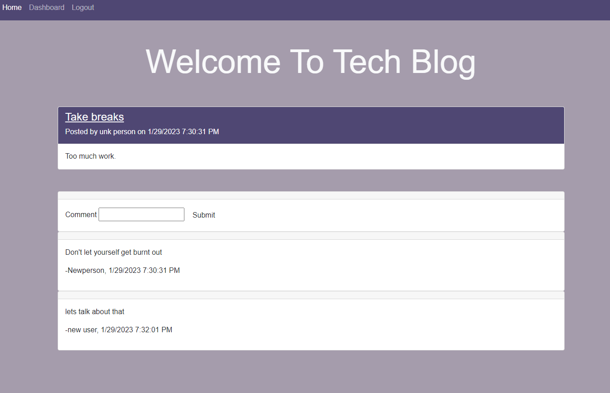

# Tech-Blog

## Description
The application functions as a blog site.provides a content management system (CMS) to run a blog site. Any visitor is greeted with a list of posts added to the site. Users can log in to publish a post on the site and leave comments on posts. Logged in users have the ability to edit or delete previous posts from their dashboard. Non-logged in users can freely view published posts, but need to sign up to publish posts or leave comments. 
Also the application is deployed on Heroku. you can find links below. 

## Installation
Download or clone repository 
-npm install to install the required npm packages 
-npm install mysql2 
-npm i express sequelize 
-npm i bcrypt 
-npm i express 
-npm i dotenv 
-npm i handlebars 
-npm i sequelize 

Open VsCode Terminal 
-open db folder 
-type mysql -u root -p 
-source schema.sql 
-npm run seed 
-npm start 
-Open browser http://localhost:3001/ to run this application on your local machine. 

## Usage
To run project on local mashine you also need to change password
in .env file to your personal (Mysql) password

## Images of Deployed Application

## Relevant Links
Deployed Application:
 
GitHub Repo:

